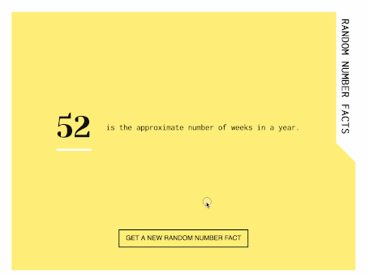

# Random Number Facts

**[Live Demo](https://random-number-facts.netlify.com/)** hosted on Netlify

## About

This is just a little experiment playing with the [Numbers API](http://numbersapi.com). This is my first time using a third-party API, so I wanted to keep it simple.

I'm generating random numbers between 0 and 360 and using the Numbers API to retrieve facts associated with those numbers. In browsers that support [CSS variables](https://caniuse.com/#feat=css-variables) (custom properties), the color used throughout will change to the hue of the random number generated by using hsl as the color format.

## Accessibility

### Color

All hues generated meet the WCAG contrast ratio requirements according to those I tested using Lea Verou's wonderful [contrast ratio testing tool](https://leaverou.github.io/contrast-ratio/).

### Keyboard

New random number facts can be generated when keyboard focus is on the "get new number fact" button by pressing <kbd>ENTER</kbd> or <kbd>SPACEBAR</kbd>.

### Screenreaders

Using `aria-live` on the dynamic text container, each new number and fact will be announced for screenreader users. _NOTE: I've tested this on a Mac using VoiceOver in Safari and Chrome. Further testing is needed._
